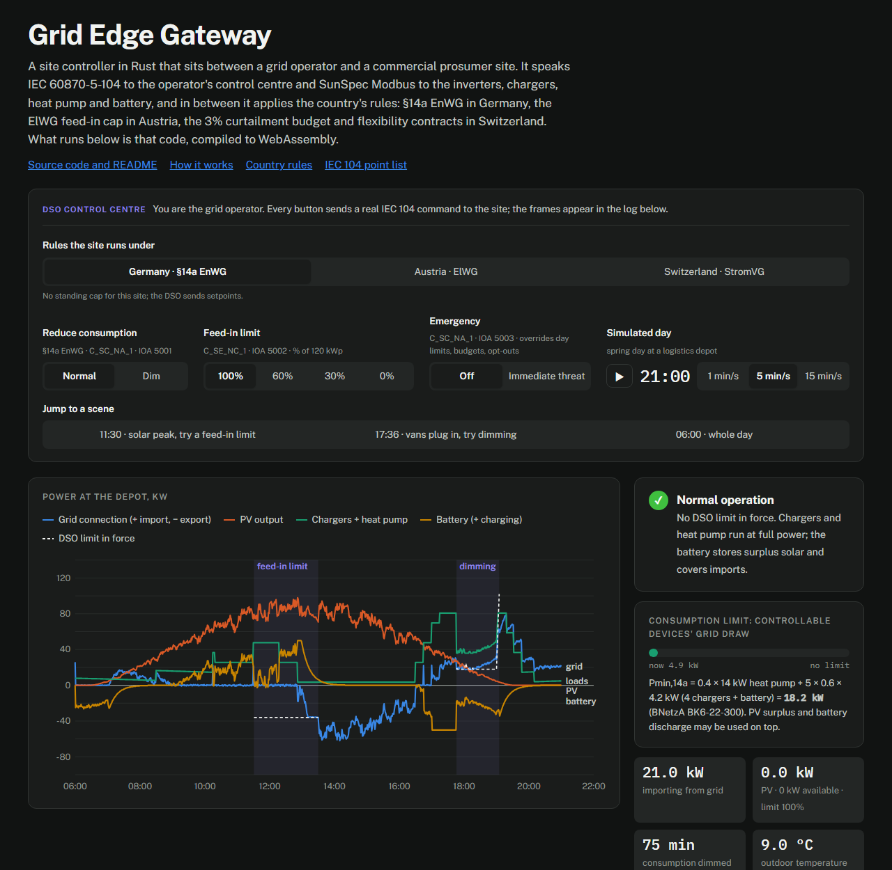
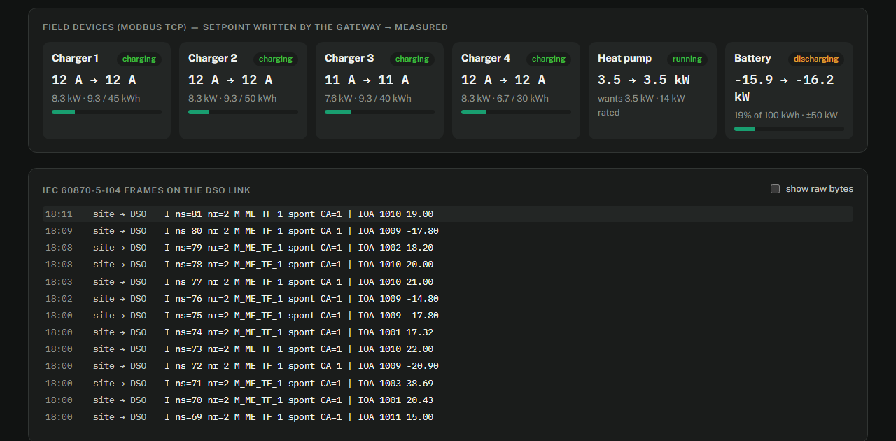

# Grid Edge Gateway

**A site controller in Rust between a grid operator and a prosumer site in Germany, Austria or Switzerland: IEC 60870-5-104 towards the DSO, SunSpec Modbus towards PV, chargers, heat pump and battery, and each country's rules for dimming and feed-in limits in between.**

**[Open the live demo →](https://maycu-byte.github.io/grid-edge-gateway/)** The demo runs this code in your browser, compiled to WebAssembly. You play the grid operator: pick the country, send the commands and watch the site respond, frame by frame.



## The problem

Distribution grids in Central Europe now have to control what happens behind the meter. Rooftop PV peaks at noon, and heat pumps and EV chargers peak in the evening, on low-voltage grids that were built to deliver power one way. Each country gives its DSOs a different set of rights:

| | Consumption | Feed-in | Source |
|---|---|---|---|
| **Germany** | §14a EnWG: the DSO may dim heat pumps, chargers and batteries, but must leave a guaranteed minimum, *Pmin,14a* | DSO setpoints for plants over 100 kW (EEG §9); new systems without smart meter capped at 60% (Solarspitzengesetz, 2025) | [BNetzA BK6-22-300, Anlage 1](https://www.bundesnetzagentur.de/DE/Beschlusskammern/1_GZ/BK6-GZ/2022/BK6-22-300/Beschluss/BK6-22-300_Beschluss_Anlage1.pdf?__blob=publicationFile&v=1) |
| **Austria** | No statutory minimum like §14a was found in the sources checked; modelled as a flexibility contract | *Spitzenkappung*: the DSO may cap feed-in of new or extended PV at up to 70% of module peak power; a dynamic version is planned for 2028 | ElWG (BGBl. I 91/2025); [BMWET factsheet](https://www.bmwet.gv.at/dam/jcr:260fda60-c745-4861-bdcb-1c1223a4af58/ElWG-Factsheets_Spitzenkappung_final%20final.pdf) |
| **Switzerland** | Flexibility is used by contract, with pay; the owner may forbid uses that existed before 2026 | Guaranteed, unpaid curtailment of **at most 3% of the yearly energy** at the connection point; unlimited in an immediate, serious threat | [StromVG Art. 17c](https://www.fedlex.admin.ch/eli/cc/2007/418/de), StromVV Art. 19a–19d (in force 1 Jan 2026) |

The box on site has to speak the DSO's protocol on one side and the devices' protocols on the other, apply the right country's rules, and stay safe when a link, a device or the box itself fails. This project builds that box, with one controller and three rule sets.

## The demo site

A logistics depot with **120 kWp** rooftop PV (two 60 kW inverters), **four 22 kW chargers** for delivery vans, a **14 kW heat pump** and a **100 kWh / 50 kW battery**.

```
DSO control centre ──IEC 104 / TLS──► grid-edge-gateway ──Modbus TCP / SunSpec──► inverters, meter, chargers, heat pump, battery
      (SCADA)                           (this repository)                         (site-sim, or real devices)
```

## What the gateway does

| | |
|---|---|
| **Consumption dimming** | **DE:** Pmin,14a exactly as in BK6-22-300 Anlage 1, 4.5.2: `max(0.4·ΣP_WP, 0.4·ΣP_Klima) + (n−1)·GZF·4.2 kW` with a heat pump above 11 kW, else `4.2 kW + (n−1)·GZF·4.2 kW`. For the depot (n = 6: four chargers, the battery, the heat pump; GZF 0.6): **18.2 kW**. **AT/CH:** the contract's minimum power and maximum minutes per day; devices whose owner opted out (CH) are never limited. In both cases the limit applies to power *drawn from the grid*, so PV surplus and battery discharge come on top. |
| **Allocation** | Each heat pump first gets 40% of its rating. Then as many cars as fit get the IEC 61851 minimum of 6 A, least-charged first. What is left tops up the heat pump, then the cars in whole amps. Values are always rounded *down*: when the exact value is impossible, the regulation asks for the next lower one. Cars are only rotated after a 5-minute dwell time. |
| **Feed-in limits** | The DSO setpoint, capped by the country's standing limit (AT 70%, DE 60% where it applies), applied at the grid connection: PV may produce more while the site consumes or stores it. In CH the gateway counts curtailed energy against the 3% budget and refuses non-emergency curtailment beyond it. |
| **Battery** | Stores what would be exported, so a feed-in limit is absorbed before any PV is curtailed; covers imports; while dimmed, discharges so the loads keep more of their budget. It never charges from the grid while dimmed. |
| **Emergency** | A separate command for an immediate, serious threat (StromVG 17c 4b): overrides day limits, budgets and opt-outs. |
| **Gradual release** | After a dimming ends, power returns linearly over 5 minutes (BK6-22-300, 4.3); a raised feed-in limit returns at about 10% of installed power per minute. |

## IEC 104 point list (common address 1)

| IOA | Type | Direction | Meaning |
|---|---|---|---|
| 5001 | C_SC_NA_1 | DSO → site | Reduce consumption ON / OFF (§14a in DE, contract in AT/CH) |
| 5002 | C_SE_NC_1 | DSO → site | Feed-in limit, % of installed PV (0–100; other values get a negative confirmation) |
| 5003 | C_SC_NA_1 | DSO → site | Emergency ON / OFF |
| 1001 | M_ME_TF_1 | site → DSO | Active power at the grid connection, kW (+ import) |
| 1002 | M_ME_TF_1 | site → DSO | PV active power, kW |
| 1003 | M_ME_TF_1 | site → DSO | Controllable devices (steuVE), kW |
| 1004 | M_ME_TF_1 | site → DSO | steuVE power drawn from the grid, kW: the quantity a consumption limit applies to |
| 1005 | M_ME_TF_1 | site → DSO | Consumption floor while dimmed, kW (Pmin,14a in DE) |
| 1006 | M_ME_TF_1 | site → DSO | Feed-in limit commanded, % (feedback of 5002) |
| 1007 | M_ME_TF_1 | site → DSO | PV limit sent to the inverters, % |
| 1008 | M_ME_TF_1 | site → DSO | Feed-in limit in force after country rules, % |
| 1009 | M_ME_TF_1 | site → DSO | Battery power, kW (+ charging) |
| 1010 | M_ME_TF_1 | site → DSO | Battery state of charge, % |
| 1011 | M_ME_TF_1 | site → DSO | Consumption dimmed today, minutes |
| 1012 | M_ME_TF_1 | site → DSO | PV energy curtailed this year, kWh |
| 1013 | M_ME_TF_1 | site → DSO | Free curtailment budget used, % (CH) |
| 2001 | M_SP_TB_1 | site → DSO | Consumption dimming active (feedback of 5001) |
| 2002 | M_SP_TB_1 | site → DSO | Gradual release in progress |
| 2003 | M_SP_TB_1 | site → DSO | Meter fallback (grid measurement lost) |
| 2004 | M_SP_TB_1 | site → DSO | Field device fault |
| 2005 | M_SP_TB_1 | site → DSO | Emergency active (feedback of 5003) |
| 2006 | M_SP_TB_1 | site → DSO | Contract day limit reached, dimming refused |
| 2007 | M_SP_TB_1 | site → DSO | Curtailment budget used up |

Commands support direct execute and select-before-operate. Unknown addresses, types, causes and common addresses get the negative confirmations the standard defines (causes 44–47). Measurements are sent spontaneously outside a deadband and all together in a general interrogation.



## Robustness

| Failure or edge case | What happens |
|---|---|
| Gateway crashes or hangs | Each charger's watchdog (armed at start) drops it to **6 A = 4.14 kW** after 30 s, below 4.2 kW on its own. The battery's BMS watchdog idles it. Inverter limits are written with **no revert timeout** (SunSpec `WMaxLimPct_RvrtTms = 0`), so the last DSO limit stays in force. |
| Gateway restarts | DSO commands and the running totals (minutes dimmed today, energy curtailed this year) are persisted with write-then-rename, so a dimming or a used-up budget survives a power cut. |
| Grid meter lost **or implausible** | A reading far beyond the connection rating (e.g. a wrong scale factor) counts as lost. The budget shrinks to the floor; the feed-in limit falls back to plant-output mode. Point 2003 goes ON. |
| A device stops answering | Assumed to draw its failsafe current (charger) or rated power (heat pump); a silent battery is assumed idle. The budget for the others shrinks accordingly. |
| Battery and curtailment chase each other | The battery plans from the PV the sun *allows* (vendor SunSpec model 64900), so a curtailment never looks like a deficit to discharge into. Without that reading it never discharges under a feed-in limit. |
| DSO link lost | Configurable: `hold` the last commands (default) or `release` them after a set time. An emergency always stays until the DSO clears it. |
| A contract's day limit or a budget is used up | The command is refused, the refusal is reported (2006 / 2007), and an emergency still overrides it. |
| Control loop too slow | Cycles longer than the period are counted and logged; the cycle time is in the API. |
| Configuration mistakes | Validated at start: unknown country, contract settings for DE, caps outside 0–100%, a failsafe current a car would not accept, and more. |
| Someone else reaches port 2404 | With TLS on, the station accepts only client certificates signed by the DSO's CA (TLS 1.2/1.3, in the spirit of IEC 62351-3). |

## How it is built

| Crate | What it is |
|---|---|
| [`iec104`](crates/iec104) | IEC 60870-5-104 from scratch, with no dependencies: APDU framing, the ASDUs above plus clock sync and interrogation, CP56Time2a, and the controlled-station link layer (k/w windows, t1/t2/t3 timers, 15-bit sequence numbers) as a **sans-IO state machine**, so every timing rule is unit-tested without sleeping. An optional tokio driver runs it over TCP or TLS. |
| [`control`](crates/control) | Country policies (`policy.rs`), running totals (`accounting.rs`) and the controller: pure functions and a small state machine. The same code runs in the gateway, in the tests and in the browser. |
| [`devices`](crates/devices) | SunSpec register layouts (models 1, 103, 120, 123, 203 and a vendor model), typical wallbox and battery maps with watchdogs, and a deterministic physics simulation of the depot. |
| [`gateway`](crates/gateway) | The binary: one supervised task per Modbus device (SunSpec discovery by walking the model chain, reconnect, staleness detection), a 1 s control loop, the IEC 104 station, TLS (rustls), persistence and a read-only JSON/WebSocket API. |
| [`site-sim`](crates/site-sim) | Every device of the depot as its own Modbus TCP server, with an HTTP endpoint to take devices offline. |
| [`web-demo`](crates/web-demo) | The browser build: simulation + controller + IEC 104 encoder in WebAssembly. The controller reads and writes the simulated devices through their register maps, like the gateway does over Modbus TCP. |

## Testing

- **79 Rust tests.** They cover:
  - protocol frames checked against reference octets, every link-layer timer and window, sequence-number wrap-around;
  - the Pmin formula for several device mixes, allocation scenarios, each country's rules, day and year roll-over of the totals, the battery, plausibility checks, ramps and config validation;
  - two property tests over 35,000 random site states. While dimmed, in every country and with a battery, the loads never get more than the floor + PV surplus + battery discharge. Every charger current is 0 or 6–32 A in whole amps.
- **17 interoperability tests** ([`interop/`](interop/test_interop.py)). They start the real simulator and gateway and drive them with [c104](https://github.com/Fraunhofer-FIT-DIEN/iec104-python), a Python binding of lib60870, as the DSO control centre. They cover:
  - general interrogation, §14a compliance within seconds, gradual release and negative confirmations;
  - meter loss, a battery gone silent, the emergency command and the link-loss policy;
  - persistence across a restart, the Austrian 70% cap and the Swiss 3% budget running out;
  - TLS acceptance and rejection.
- CI runs `fmt`, `clippy -D warnings`, all tests and the interop suite on every push, then builds the WebAssembly demo and deploys it to GitHub Pages.

## Run it locally

Needs Rust (stable) and, for the interop tests, Python 3.10+.

```sh
cargo build
./target/debug/site-sim --start 17:30                  # the depot, Modbus TCP on :5020–5028
./target/debug/gateway gateway.toml                    # Germany; IEC 104 on :2404, API on :8080
./target/debug/gateway examples/gateway-ch.toml        # or Switzerland (examples/gateway-at.toml: Austria)
```

Then act as the DSO with any IEC 104 master (address 1, IOA 5001 / 5002 / 5003), or run the tests:

```sh
pip install -r interop/requirements.txt
sh certs/gen-demo.sh                           # throw-away PKI for the TLS tests
python -m pytest -v interop
```

To enable TLS, uncomment `[iec104.tls]` in `gateway.toml`. For the browser demo, run `web/build.sh`, which needs the `wasm32-unknown-unknown` target and `wasm-bindgen-cli` 0.2.128.

## Limits and honest notes

- **Rules, not legal advice.** The country rules are taken from the texts linked above as of September 2026. The Austrian rules were read from the ministry's factsheet and secondary sources, because the official legal database blocks automated access; no Austrian consumption-side minimum was found. DSOs' technical connection rules add details not modelled here.
- **Simulated devices.** The wallbox, battery and heat-pump register maps follow common patterns but are not a specific product's map; the available-power register is a vendor model, as on real inverters. SunSpec layouts follow the published models.
- **Signal path.** In German households the §14a signal usually travels through the smart meter gateway (CLS channel) to an FNN control box or via EEBUS. IEC 104 is the standard telecontrol path for larger plants (from 100 kW). This project uses IEC 104 for all commands to keep one DSO interface; the control logic does not depend on the transport.
- **Protocol scope.** The IEC 104 stack implements the subset a controlled station of this kind needs, not the full companion standard (no file transfer, no redundancy groups). It is not certified; it is tested against lib60870.
- **Clock.** Day and year boundaries for the running totals use UTC.
- **TLS interop.** The c104 2.2.1 client cannot be used for TLS here: its bundled mbedtls 3.6 refuses to verify a server without a hostname (`-0x5D80`), and the released binding cannot set one yet. The TLS tests therefore send raw IEC 104 frames through Python's `ssl` (OpenSSL).

## License

MIT. Built by Michael Hiarley Silva Andrade, electrical engineering student at UFC, Brazil.
